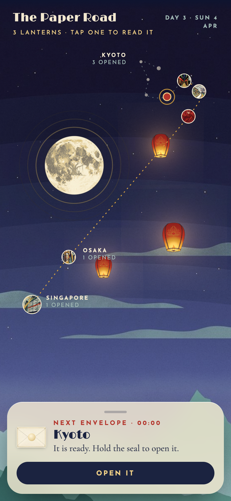
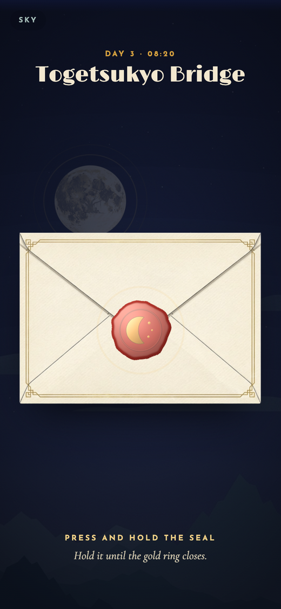
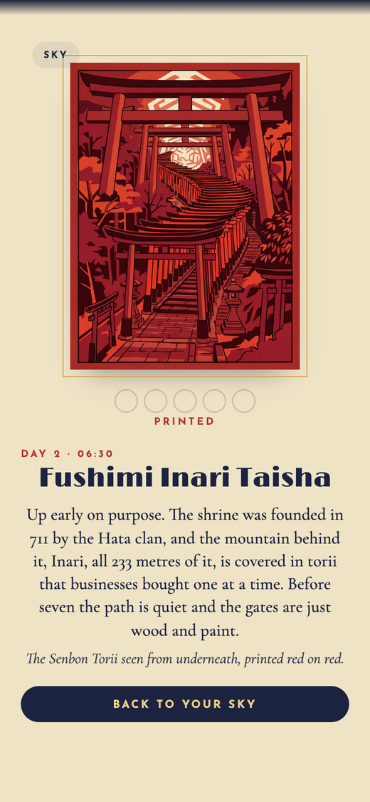
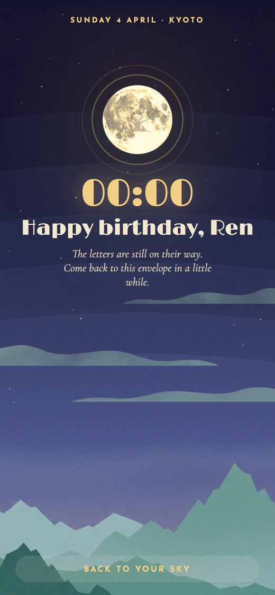
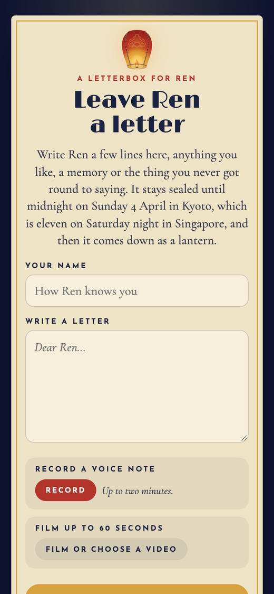
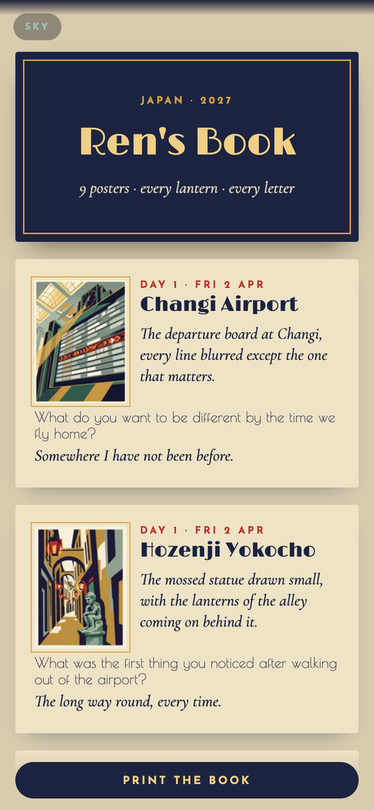

# The Great Adventure

A Claude Code plugin that plans a trip properly, then hands it over as something worth keeping.
Either a printed guide of travel posters, or an interactive journey the traveller unseals one stop
at a time as they go. Same trip file, your choice, or both.

**There is a live one to walk through: [the-paper-road.vercel.app](https://the-paper-road.vercel.app)**
It is the worked example in this repo, four days from Singapore to Osaka to Kyoto. The bar across
the top only appears on a journey marked as a demo, and it skips you through in a minute what would
otherwise take four days.

  
  
  

## The five skills

| | |
|---|---|
| **trip-plan** | Keeps one trip file. Flags missing nights, unbooked items and passport problems, and adds the forecast. |
| **trip-research** | One agent per day, finding facts with a source for each, reference photos, and public domain postcards, stamps and maps with their credits. |
| **trip-book** | Compares live options and hands you a shortlist with links. You pay. It records the booking. |
| **trip-guide** | Turns each stop into a 1930s style travel poster with no words on it, drawn from a real photo, and prints a page per day as a PDF. |
| **trip-journey** | Builds the sealed app: envelopes that open at their time or when the traveller arrives, posters that print plate by plate, questions that become paper lanterns, and a book at the end. |

## The journey

Each stop is an envelope. It will not open before its time, and if the traveller allowed location
it opens early the moment they are standing in the right place. Inside, a letter unfolds into a
poster that prints itself one ink plate at a time, three lines about where they are, and a note
from whoever made it.

About half the stops ask a question. The answer rises into the night sky as a paper lantern, or a
crane, or an ember, depending on the theme, and the sky tilts with the phone. One named date
later, the first one comes back so they can read what they wrote.

  
  
  

If there is one moment in the trip that matters more than the rest, friends can leave a letter, a
voice note or a video in a letterbox beforehand. Everything stays sealed until that minute, then
comes down as lanterns. It is all held on the phone by a service worker, so it still works where
there is no signal.

## Install

In Claude Code:

    /plugin marketplace add markiewee/great-adventure
    /plugin install great-adventure@great-adventure

The skills run a small Python helper that ships inside the plugin. It needs Python 3.10 or newer
with Pillow:

    pip install Pillow

You also need Google Chrome to print PDFs. Two things are optional:

- `GEMINI_API_KEY` and `pip install google-genai`, to generate posters through Google's image API.
  Google charges per image, so the guide skill asks before it spends anything. Without a key it
  writes a card you can paste into Google Flow instead.
- `tesseract` and `pip install pytesseract`, to check posters for stray lettering.

## Try it

    Plan a 4-day trip to Kyoto in April for two, then make it an interactive journey.

The helper also works on its own:

    python3 -m adventure gaps templates/trip.example.json
    python3 -m adventure commons-search "Kamo River 1915"

The worked example is the Japan journey inside the engine. It has no art of its own until a theme
dresses it, so scaffold a copy and look at that:

    python3 -m adventure journey new /tmp/demo --theme kyoto-woodblock
    python3 -m adventure journey check /tmp/demo
    cd /tmp/demo && python3 server.py

## Make your own journey

Honestly, about an afternoon.

1. **Copy the engine.** `python3 -m adventure journey new my-journey --trip my-trip.json --theme kyoto-woodblock`
2. **Edit one file.** `my-journey/public/data/trip.json` holds everything: the title, who it is
   for, who it is from, and a stop per envelope with a time, a place, a lat/lng and three lines of
   copy. Every word on screen comes out of that file.
3. **Bring posters.** `trip-guide` draws them. Then
   `python3 -m adventure plates poster.jpg --out my-journey/public/img` cuts each one into the
   phone sized poster, the map thumbnail and the five ink plates the printing animation uses.
4. **Check and build.** `adventure journey check my-journey`, then `adventure journey build`.
5. **Rehearse.** `python3 server.py`, then `node qa/rehearse.mjs` plays the whole journey through
   on a headless phone and screenshots every step.
6. **Deploy.** `vercel deploy --prod`. Send the link.

A journey nobody is travelling, like the worked example in `templates/journey`, can set
`"demo": true` and get a bar of buttons that skip through it. On a real journey that would hand a
stranger the letters early, so `journey check` warns about it every time it sees it.

You do not have to draw a map. The road is projected from the coordinates the stops already carry,
with a pass that pushes apart any stops sharing one front door, so it keeps its zigzag whether the
journey is five envelopes across one city or fifty across a country. Set `xy` on a stop if you want
to place it by hand instead.

The letterbox is the only part that needs accounts: two Vercel Blob stores, one private for the
letters and one public for the recordings, because a store is public or private for its whole life.
A journey without a letterbox needs neither, and everything else works the same.

## Themes

A journey's painted art, its colours, its four typefaces and every word on its screen come out of
a theme. Three ship:

| Theme | The night | What an answer becomes |
|---|---|---|
| `lantern-night` | art deco, indigo and lacquer red | a paper lantern |
| `kyoto-woodblock` | ukiyo-e, the hills east of Kyoto | a paper crane |
| `canyon-ember` | a WPA screenprint of a desert rim | an ember |

    adventure journey new trips/kix/app --trip trips/kix/trip.json --theme kyoto-woodblock
    adventure journey retheme trips/kix/app --theme canyon-ember

The same theme feeds the poster prompts and the printed guide, so a trip's posters and its app
cannot drift apart. `retheme` refuses once the traveller has answered a question, because their
own words were written under one noun and cannot be read back under another.

To build one:

    adventure theme new harbour-dusk

That writes the folder and `PROMPTS.md`, the brief for five images with the size each has to end
at. Generate them, name each file after its slot, then:

    adventure theme cut harbour-dusk --from ~/Downloads/harbour --moon trim

which trims the paper margin generators print, crops the moon, and lifts the rising thing off its
background. Fill in `theme.json`'s house prompt and its noun, and override any line you want in
your own voice. Every line you do not write is inherited from `templates/themes/_base/copy.json`
with your noun dropped into it, so a theme can exist with one word.

A theme owns no code. It cannot change how an envelope opens, only what it is made of.

## Rules it keeps

- It never pays, never types card details or passwords, and never presses the final booking button.
- It never publishes, deploys or sends anything without your go. That includes the journey link.
- Every fact has a source. Anything it could not check is labelled.
- Posters carry one idea each and have no words on them. Every real place is drawn from a real photo.
- Every public domain or Creative Commons file keeps its credit.
- A journey is private by default. Every page it builds carries `noindex, nofollow`, and the
  traveller's own answers are never shown to the person who made it.

## What's inside

    skills/             the five skills and the poster rules
    adventure/          the Python helper (python3 -m adventure --help)
    templates/          a sample trip, the A4 page template and its CSS
    templates/themes/   the three themes, and the base copy every theme inherits
    templates/journey/  the journey engine, with a worked example inside it
    tests/              pytest, plus node --test for the map and the journey loader

## Licence

MIT
